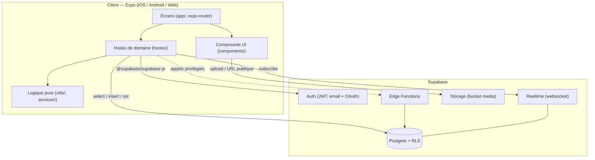
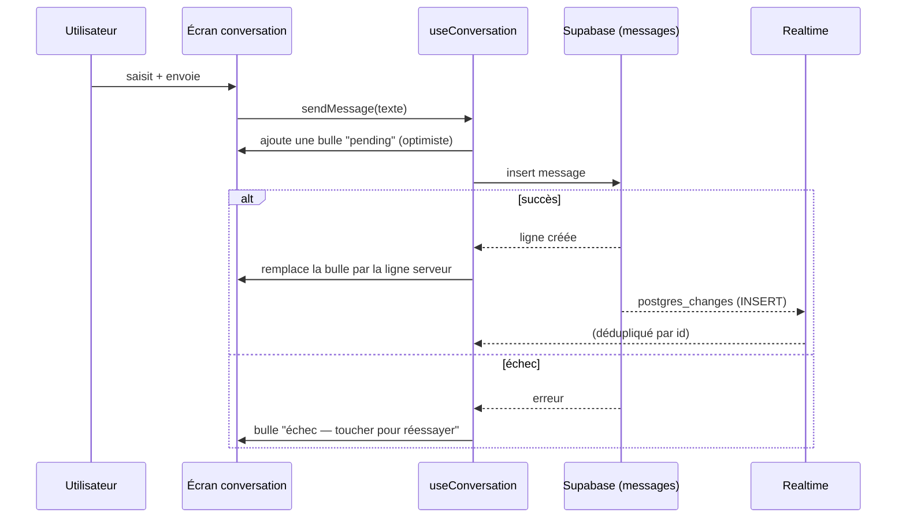

# Architecture

## Vue d'ensemble

## Principes

- **Un hook par domaine** (`useConversations`, `useFavoris`, `useAnnonceDetail`…).
  Les écrans ne parlent jamais directement à Supabase : ils consomment un hook.
- **RLS d'abord.** La sécurité vit dans Postgres (policies), pas dans le client.
  Les opérations qui doivent contourner RLS passent par une fonction
  `security definer` (RPC) ou une Edge Function.
- **Logique pure extraite.** Tout ce qui est testable sans rendu (validation,
  formatage, regroupement de messages) vit dans `utils/` et est couvert par Jest.
- **Temps réel opportuniste.** La messagerie s'abonne aux `postgres_changes` ;
  l'UI applique un rendu optimiste puis se réconcilie avec la ligne serveur.
- **Design tokens centralisés.** Couleurs / spacing / radius dans
  `constants/theme.ts`, consommés via `useTheme()`.

## Flux : envoi d'un message

## Conventions de code

- TypeScript strict, chemins alias `@/*`.
- Fichiers d'écran : un composant par défaut, styles en bas via `StyleSheet.create`.
- Pas de couleur en dur dans les écrans (utiliser `useTheme()`), sauf
  `ErrorBoundary` qui doit survivre à une panne du thème.
