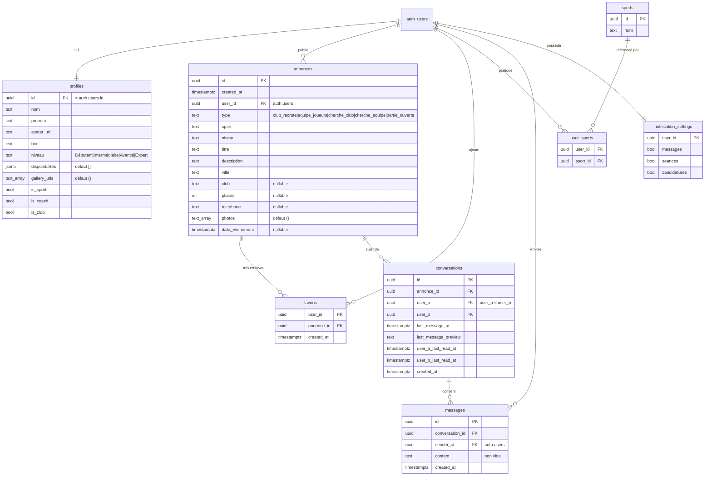

# Schéma de base de données

Postgres géré par Supabase. Toutes les tables applicatives ont la **Row Level
Security (RLS)** activée ; les policies sont définies dans les migrations
[`supabase/migrations/`](../supabase/migrations).

## Diagramme entité-relation

## Règles d'accès (résumé)

| Table                   | Lecture                                   | Écriture                                        |
| ----------------------- | ---------------------------------------- | ---------------------------------------------- |
| `profiles`              | (selon migration socle)                  | soi-même                                       |
| `annonces`              | publique                                 | `insert` authentifié, `update`/`delete` = auteur (`user_id`) |
| `favoris`               | soi-même                                 | soi-même                                       |
| `conversations`         | participant (`user_a` ou `user_b`)       | `insert` participant ; pas d'`update` direct   |
| `messages`              | participant de la conversation            | `insert` si `sender_id = auth.uid()` et participant |
| `notification_settings` | soi-même                                 | soi-même                                       |
| storage bucket `media`  | publique en lecture                       | écriture/màj/suppression = propriétaire du dossier |

## Fonctions & triggers

| Objet                                   | Rôle                                                                 |
| --------------------------------------- | ------------------------------------------------------------------- |
| `bump_conversation_last_message()` (trigger `after insert on messages`) | met à jour `last_message_at` / `last_message_preview` et cale le `last_read_at` de l'expéditeur |
| `mark_conversations_read()` (RPC)       | marque **toutes** les conversations de l'utilisateur courant comme lues |
| `mark_conversation_read(conv_id uuid)` (RPC) | marque **une** conversation comme lue (utilisé à l'ouverture du fil) |

## Realtime

Publication `supabase_realtime` : tables `conversations` et `messages`
(pour la messagerie temps réel et le badge de messages non lus).

## Migrations

| Fichier                              | Contenu                                                            |
| ------------------------------------ | ---------------------------------------------------------------- |
| `0001_phase1_socle.sql`              | colonnes profil (niveau, dispos, galerie), `annonces` (photos, date), `favoris`, bucket `media` + policies storage |
| `0002_messagerie.sql`                | `conversations`, `messages`, RLS, trigger de bump, publication realtime |
| `0003_lecture_messages.sql`          | colonnes `*_last_read_at`, `mark_conversations_read()`             |
| `0004_lecture_conversation.sql`      | `mark_conversation_read(conv_id)`                                 |
| `0005_candidatures.sql`              | `candidatures`, `notifications`, triggers de notification, `mark_notifications_read()`, realtime |
| `0006_suppression_compte.sql`        | `annonces.user_id` en `on delete cascade`, RPC `delete_user()` (RGPD) |
| `0007_moderation.sql`                | `signalements`, `blocks` + RLS                                    |
| `0008_profil_public_avis.sql`        | `avis` (note 1-5) + RLS (insert réservé aux membres déjà en conversation) |
